<div align="center">

# LevelHead

### Deskew Before You Classify: Training-Free Page Orientation for Any Model

[](LICENSE)
[](#installation)
[](https://beingamanforever.github.io/LevelHead/)


**Level the page first, then ask any orientation model about the four quarter turns of the level page.**<br>
No training, no new parameters, one deskewer call and four backbone calls.


</div>

## TL;DR

Document pipelines that correct orientation **classify the quarter turn first, then deskew**.
Orientation classifiers, from mobile CNNs to large vision-language models, are trained on level pages, so a tilted page is outside anything they have seen, and a deskewer that runs afterwards cannot undo a wrong quarter turn.

LevelHead reverses the order and adds a principled vote:

1. **Level** the page with a spectral deskewer that reads the tilt modulo 90°.
2. **Ask** the frozen backbone about the level page in its four quarter turns.
3. **Roll back** each answer by the turn it added and combine the four with a **geometric mean**.

| | Classify-first | + four-view vote | Level-first, one view | **LevelHead** |
|---|:---:|:---:|:---:|:---:|
| VLMs (5 models) | 31.0 | 55.7 | 46.7 | **86.7** |
| Classifiers (4 models) | 71.9 | 77.6 | 83.7 | **85.2** |

<sub>Accuracy (%) within 15° on the arbitrary-angle benchmarks (ODB-any, ORB En-12, ORB Indic-8), averaged per backbone. Order and vote are complementary; for VLMs only both together close the gap.</sub>

## How it works


Any angle splits as θ = 90°·k + s, a quarter turn *k* and a tilt *s* ∈ [−45°, 45°).
Rows of text reveal *s* and look the same after a quarter turn; the shapes of letters reveal *k*.
So the deskewer removes *s* first and the classifier only ever sees the kind of page it was trained on.

The rolled vote is frame averaging over a coset of the rotation group, which gives three properties for **any** backbone:

- **Equivariance**: turning the input by φ turns the answer by φ, up to interpolation and deskew error.
- **Bias cancellation**: an input-independent preference for one class (for example a VLM that likes "upright") adds the same constant to every turn and drops out of the geometric mean. A majority vote keeps it.
- **Order**: with the same aggregation, levelling first cannot be worse in expectation, as long as the deskewer does not add tilt.

### A deskewer that also reads photographs

We use [jdeskew](https://github.com/phamquiluan/jdeskew) with two untuned corrections.
The released code takes an untapered FFT, so image borders that cut through a page (every photograph, every rotated crop) put a bright cross on the frequency axes and the answer is ~0°.
A **Hann window** before the FFT removes the cross, and a peak at the **edge of the ±45° search** is kept instead of being mapped to 0°.

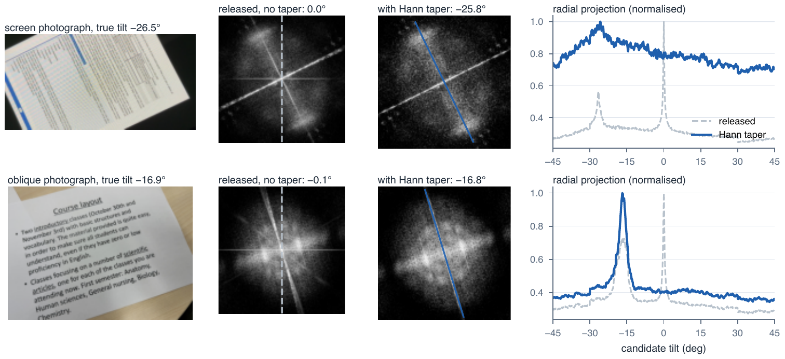

| Pages more than 15° off | jdeskew (released) | **jdeskew + Hann + edge fix** | projection profile |
|---|:---:|:---:|:---:|
| Real5 screen photographs, any angle | 30.6% | **1.3%** | 5.5% |
| Real5 oblique photographs, any angle | 33.3% | **2.6%** | 10.3% |
| DISE 2021 scans in quarter turns | 0.7% | **0.4%** | 12.0% |
| OmniDocBench pages, any angle | 0.6% | **0.4%** | 1.3% |

The correction costs on pages that are already level and pasted on photographs (ORB SynthDoG: 3.6% vs 1.6%), where the released code's pull towards 0° happens to be right.

## Results

### Every backbone, seven public benchmarks

| Backbone | Classify-first (avg) | **LevelHead (avg)** | Gain | ODB-any |
|---|:---:|:---:|:---:|:---:|
| docTR (MobileNetV3) | 80.1 | **86.5** | +6.5 | 79.9 → **91.7** |
| PP-LCNet (PaddleOCR) | 78.5 | **89.0** | +10.5 | 64.1 → **97.8** |
| Swin-T | 75.5 | **85.2** | +9.6 | 71.0 → **93.2** |
| BEiT-B | 78.4 | **80.5** | +2.1 | 67.5 → **81.1** |
| Qwen3-VL-8B | 32.6 | **80.5** | +47.9 | 33.4 → **83.9** |
| Qwen3-VL-30B-A3B | 41.7 | **70.7** | +29.0 | 34.8 → **76.1** |
| Qwen3-VL-32B | 44.3 | **95.8** | +51.5 | 35.1 → **95.2** |
| Qwen3-VL-235B-A22B | 48.8 | **91.3** | +42.5 | 34.3 → **96.2** |
| Qwen2.5-VL-72B † | 37.3 | **93.0** | +55.7 | 26.7 → **95.3** |

<sub>Accuracy (%) within 15°, averaged over ODB-4, ORB SROIE, SynthDoG, Indic-4 (quarter turns) and ODB-any, ORB En-12, Indic-8 (any angle). All 35 VLM cells improve (34 at McNemar p < 1e-4). † 950-page subset. Full table: [`results/main_table.csv`](results/main_table.csv).</sub>

### Classify-first breaks at every diagonal; LevelHead stays flat

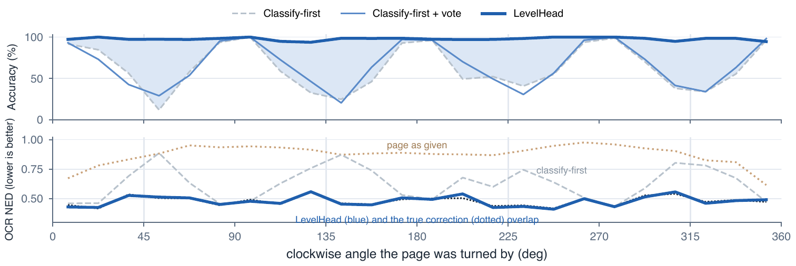

<sub>ODB-any, PP-LCNet. Top: orientation accuracy per 15° bin of the applied angle; the shaded area is LevelHead's gain. Bottom: docTR's normalised edit distance; LevelHead reads like the true correction.</sub>

<table>
<tr>
<td width="50%">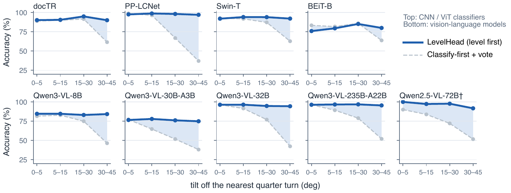<br><sub>Same backbone, same deskewer, same four-view vote: only the order differs. Accuracy against the tilt off the nearest quarter turn.</sub></td>
<td width="50%">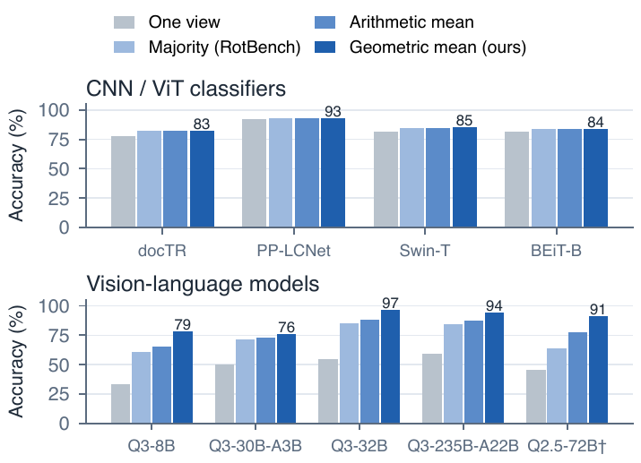<br><sub>For VLMs the aggregation rule decides the gain: the geometric mean beats RotBench's majority vote by 4–28 points and an arithmetic mean by 3–14.</sub></td>
</tr>
</table>

### Photographs and scans turned by known angles

| | Real5-Rot4 (photos) | Real5-RotAny (photos) | DISE-any (scans) |
|---|:---:|:---:|:---:|
| | CF / +vote / **LH** | CF / +vote / **LH** | CF / +vote / **LH** |
| docTR | 85.8 / 88.8 / **88.5** | 72.6 / 75.7 / **86.1** | 68.7 / 70.9 / **88.2** |
| PP-LCNet | 98.3 / 98.4 / **98.3** | 69.9 / 75.0 / **97.0** | 55.1 / 58.4 / **95.7** |
| Swin-T | 82.4 / 89.2 / **89.0** | 66.8 / 77.3 / **89.1** | 63.4 / 77.8 / **92.7** |
| BEiT-B | 86.1 / 90.2 / **90.0** | 68.0 / 76.5 / **87.0** | 72.9 / 81.8 / **88.8** |

<sub>CF: classify-first. At quarter turns the vote alone does the work; at arbitrary angles only levelling first closes the gap.</sub>

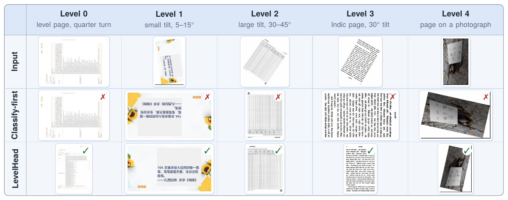

<details>
<summary><b>More figures</b>: every backbone against the angle, confusions, calibration, the label-free prior, galleries</summary>

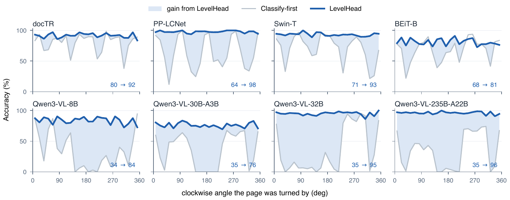
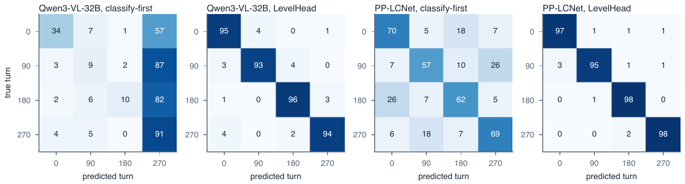
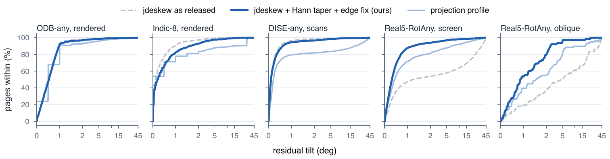
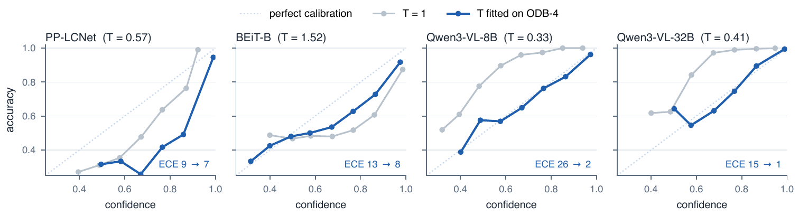
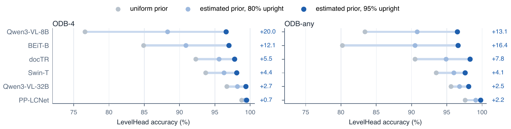
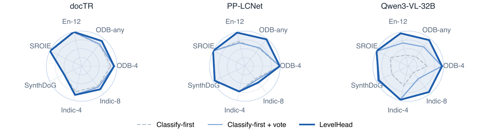
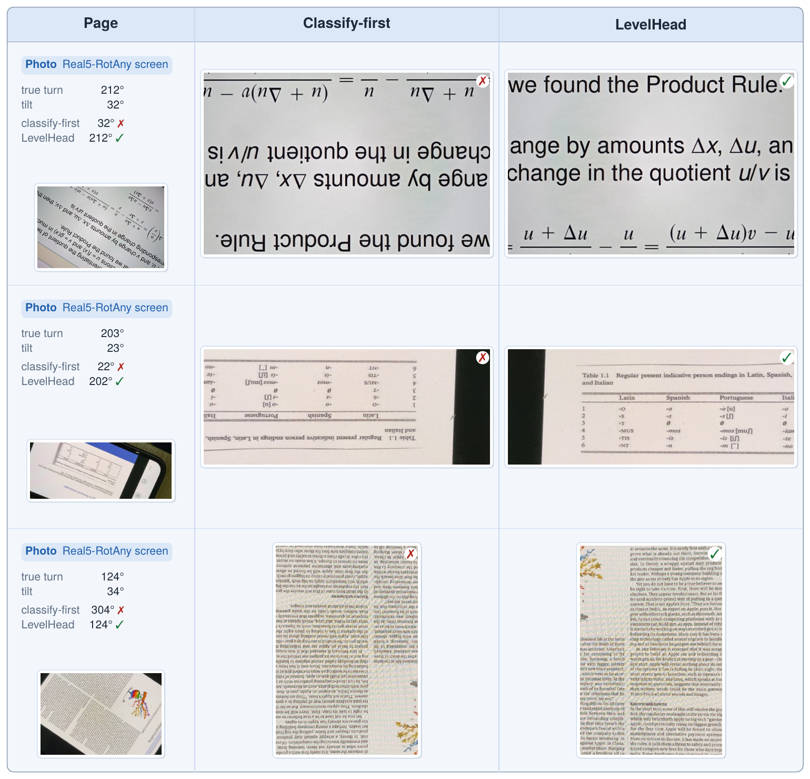
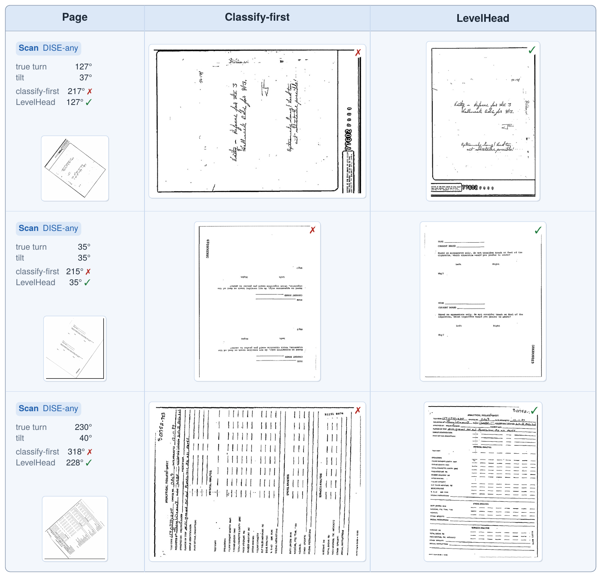

</details>

## Installation

```bash
git clone https://github.com/beingamanforever/LevelHead.git
cd LevelHead
pip install -e .            # numpy, pillow, opencv-python-headless
pip install -e ".[hf]"      # + torch and transformers for the Hugging Face backbone
```

## Quickstart

```python
from PIL import Image
from levelhead import LevelHead
from levelhead.backbones import HFOrientationClassifier

lh = LevelHead(HFOrientationClassifier("mansee/swin-tiny-patch4-window7-224-img_orientation"))
page = Image.open("scan.jpg")

pred = lh.predict(page)
print(pred.angle, pred.tilt, pred.posterior)   # clockwise angle the page is turned by, tilt, P(turn)
lh.correct(page).save("upright.jpg")
```

Or from the command line:

```bash
python examples/demo.py scan.jpg --out upright.jpg
```

**Any backbone works.** A backbone is a callable that maps a list of PIL images to an `(N, 4)` array whose column *k* is "turned *k* quarter turns counterclockwise".
Wrap a CNN, a ViT, an OCR engine's page classifier or a VLM that returns letter probabilities; use `levelhead.backbones.probe_convention` to find a model's label order from a few upright pages.

## Repository layout

```
levelhead/            the method: deskewer (Step 1), rolled geometric vote (Steps 2-3), backbone adapters
examples/demo.py      correct one page from the command line
tests/                end-to-end self-checks (python tests/test_levelhead.py)
experiments/          scripts behind the paper's new benchmarks, VLM runs and deskewer study
results/              per-backbone accuracies on the public benchmarks
assets/               figures used here
docs/                 project page
```

## Benchmarks

| Set | Pages | What it tests |
|---|---:|---|
| ORB ([Goswami et al.](https://arxiv.org/abs/2511.04161)) SROIE / SynthDoG / Indic-4 | 347 / 500 / 328 | quarter turns, receipts, documents on photographs, 11 Indic scripts |
| ORB En-12 / Indic-8 | 50 / 638 | 30° steps, every page tilted |
| **ODB-4 / ODB-any** (ours) | 1,651 each | all OmniDocBench pages in seeded quarter turns / at a uniform angle |
| **Real5-Rot** (ours) | 1,433 × 2 | Real5 phone photographs turned by known quarter turns and angles |
| **DISE-any** (ours) | 2,800 | DISE 2021 test scans (known skew) in balanced quarter turns |

We release labels and builders, not images, so each source dataset stays under its own terms: see [`experiments/`](experiments/).

## Limitations

- All five VLMs in the main table are Qwen models; other families may be more or less biased in a single view.
- Large tilts are mostly synthetic; the phone photographs we hand-labelled are mildly tilted (median 7.5°).
- Vertical scripts, content printed sideways and pages that are mostly picture remain hard: no view tells which way is up.
- LevelHead runs the backbone four times; for classifiers an early exit cuts this to 2.8–4.0 calls per page for at most 0.7 points.

## Acknowledgements

LevelHead builds on [jdeskew](https://github.com/phamquiluan/jdeskew) (Pham et al., ICIP 2022), and is evaluated on [OmniDocBench](https://github.com/opendatalab/OmniDocBench), [ORB](https://arxiv.org/abs/2511.04161), Real5-OmniDocBench and [DISE 2021](https://huggingface.co/datasets/phamquiluan/DISE-2021). We thank their authors for releasing them.

## Citation

The paper is under review; a citation will be added here.

## License

[Apache 2.0](LICENSE)
