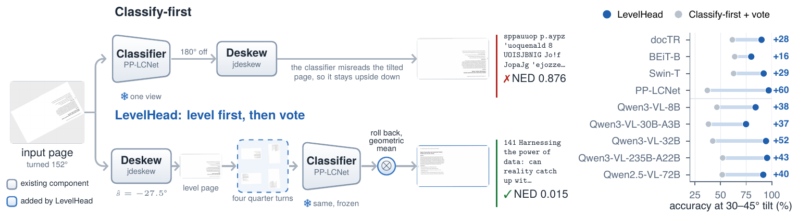
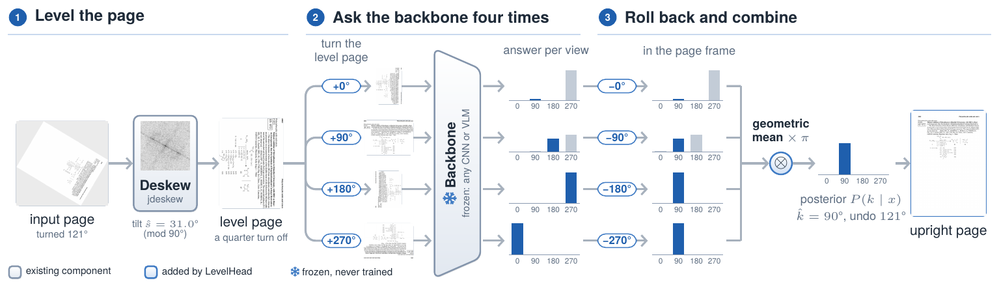

<div align="center">

# LevelHead

**Deskew before you classify: training-free page orientation for any model**

[Interactive page](https://beingamanforever.github.io/LevelHead/) · [Quickstart](#quickstart) · [Results](#results)

[](LICENSE)
[](#quickstart)




</div>

Document pipelines pick a page's quarter turn first and remove its tilt second.
Orientation models are trained on level pages, so a tilted page fools them before the deskewer ever runs.
**LevelHead swaps the order**: level the page, then let any frozen model vote over the four quarter turns of the level page.

- **Training-free**: wraps any CNN, ViT, OCR page classifier or VLM; nothing is fine-tuned.
- **Principled vote**: answers are rolled back and multiplied, so a model's fixed preference for one answer cancels out.
- **Reads photographs**: a Hann taper lets the spectral deskewer level phone photos, where the released jdeskew returns 0°.

## Results

| | Classify-first | **LevelHead** |
|---|:---:|:---:|
| 4 orientation classifiers, pages at any angle | 71.9 | **85.2** |
| 4 Qwen3-VL models, 7 benchmarks | 41.9 | **84.6** |
| GPT-4o-mini, 7 benchmarks | 34.3 | **69.9** |
| Gemma-4-31B, 7 benchmarks | 62.0 | **94.5** |
| DeepSeek-V4.1-Flash, 7 benchmarks | 68.8 | **96.5** |
| 4 classifiers, phone photos at any angle | 69.3 | **89.8** |
| 4 classifiers, DISE scans at any angle | 65.0 | **91.3** |

<sub>Accuracy (%) within 15°. Per-backbone numbers: [`results/main_table.csv`](results/main_table.csv); figures, galleries and charts: the [interactive page](https://beingamanforever.github.io/LevelHead/).</sub>

## How it works



Any angle splits as θ = 90°·k + s. Rows of text reveal the tilt *s* and look the same after a quarter turn; the shapes of letters reveal *k*.
So the deskewer removes *s* first and the classifier only ever sees the kind of page it was trained on.

## Quickstart

```bash
pip install "levelhead[hf] @ git+https://github.com/beingamanforever/LevelHead"
```

```python
from PIL import Image
from levelhead import LevelHead
from levelhead.backbones import HFOrientationClassifier

lh = LevelHead(HFOrientationClassifier())          # any images -> (N, 4) probabilities works
pred = lh.predict(Image.open("scan.jpg"))
print(pred.angle, pred.tilt, pred.posterior)        # clockwise angle, tilt, P(0/90/180/270)
lh.correct(Image.open("scan.jpg")).save("upright.jpg")
```

Command line: `python examples/demo.py scan.jpg --out upright.jpg`.

## Repository

| Path | Contents |
|---|---|
| `levelhead/` | the method: deskewer, rolled geometric vote, backbone adapters |
| `examples/`, `tests/` | command-line demo and end-to-end self-checks |
| `experiments/` | benchmark builders (ODB-4/any, Real5-Rot, DISE-any), labels, VLM runners |
| `results/` | per-backbone accuracies on the public benchmarks |
| `docs/` | the interactive page |

Builds on [jdeskew](https://github.com/phamquiluan/jdeskew) and evaluates on [OmniDocBench](https://github.com/opendatalab/OmniDocBench), [ORB](https://arxiv.org/abs/2511.04161), Real5-OmniDocBench and [DISE 2021](https://huggingface.co/datasets/phamquiluan/DISE-2021).
The paper is under review; a citation will follow. Licensed under [Apache 2.0](LICENSE).
